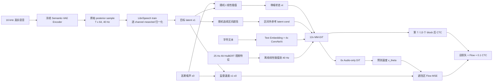
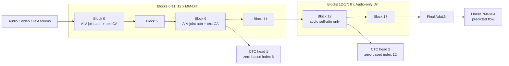
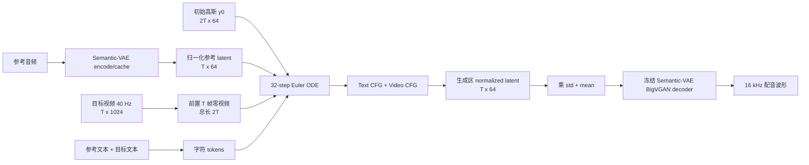
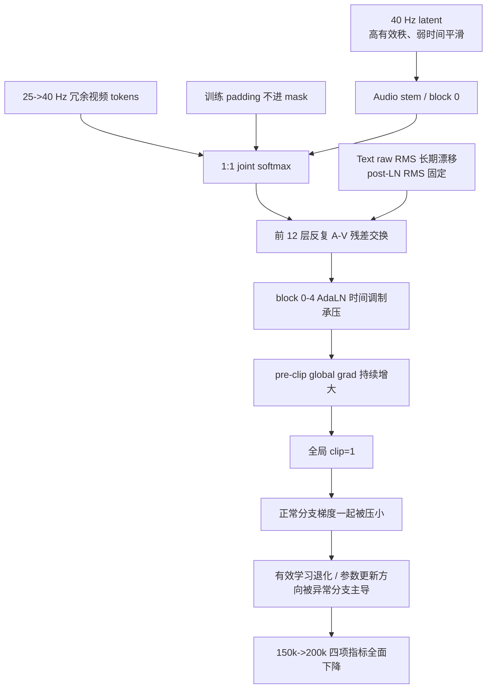
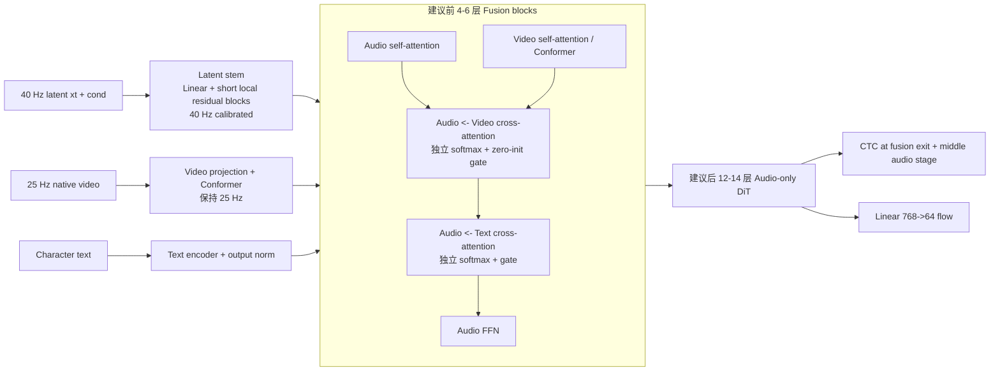

# Semantic-VAE C2 模型架构全链路梳理与重设计建议

> 日期：2026-08-15
>
> 目标快照：`AlignDiT_mmdit_c2_semantic_vae_direct/`
>
> 当前实验：Semantic-VAE C2 minimal-fix v2
>
> 本文用途：理解当前配音模型，而不是直接宣布下一版结构已经验证有效。

## 0. 结论先行

用户关于“原 Mel 架构被生硬套到 Semantic-VAE latent 上”的判断，方向上是对的，但需要精确化。

### 0.1 不是问题的核心：64 个 latent channel 不是 64 个 Mel 频带

当前音频入口没有在 `[频率, 时间]` 二维平面上卷积，也没有把第 `i` 个输入 channel 当作固定 Hz 频带。
每个时间帧的 64D 或 80D 向量只经过：

```text
[当前状态帧, 条件音频帧] -> 沿 channel 拼接 -> Linear -> 768D token
```

因此，从 `80D mel` 改为 `64D latent`，并不天然违反这个线性入口的数学语义。Semantic-VAE 论文自身也把
F5-TTS 的 mel 直接替换成 VAE latent，并取得了正向结果。

### 0.2 真正没有被重新设计的是“时间与多模态融合假设”

当前结构仍继承了下列 Mel 时代假设：

1. 一帧代表多长物理时间；
2. 31 帧卷积核对应多大的物理感受野；
3. RoPE 每前进一步代表多长时间；
4. joint attention 中音频 token 和视频 token 的数量比例；
5. flow matching 的高斯起点与数据终点有多大分布差异；
6. CTC 在每秒可使用多少帧；
7. 训练 padding 是否会进入 attention；
8. 12 层 MM-DiT 是否仍是适合 40 Hz latent 的融合深度。

这些变量没有随着表示变化被独立验证。当前最可疑的不是 `80 -> 64`，而是：

```text
Mel C2:      audio 100 Hz + video 25 Hz -> joint softmax 中 token 比约 4:1
S-VAE C2:   audio  40 Hz + video 40 Hz -> joint softmax 中 token 比约 1:1
```

视频被从 25 Hz 插值到 40 Hz 后，信息量没有同比增加，但它在每层 joint softmax 中的 token 份额从约
20% 变成 50%。这会产生“token 密度偏置”：多个高度相关的插值视频 key 共同竞争 attention mass。

### 0.3 当前失败更像“表示变化触发的融合动力学失稳”，而不是单一接口错误

现有证据链为：

- 64D/40 Hz 纯音频主干已经经过 S1-S2c 适配；
- Semantic-VAE codec 上限足够高，解码器不是最先需要推翻的组件；
- 全局 LR 从 `5e-5` 降到 `1e-5`，文本 context 增加无参数 LayerNorm 后，仍在约 149k 后长期失稳；
- 200k 的大梯度集中在 block 0-4 的 AdaLN、视频投影、视频 FFN、视频 attention 和音频 attention；
- 第一层 `attn_norm.linear.weight` 最常成为最大梯度张量；
- 150k 到 200k 的四项生成指标全面退化。

所以更合理的工作假设是：

> Semantic-VAE 改变了音频的时间统计和 CFM 几何；40 Hz 视频插值又改变了 joint attention 的模态竞争，
> 旧 C2 的 12 层强双向融合把这一错配持续放大，最后首先表现为第一层时间调制/AdaLN 路径失稳。

这仍是待受控实验验证的因果假设，不能仅凭梯度位置宣布已经证明。

---

## 1. 系统全景：模型到底在做什么

模型不是“输入视频直接输出波形”，而是一个条件流匹配的 latent inpainting 系统：



训练时没有把 Semantic-VAE encoder/decoder 放进反向传播。缓存 latent 是固定数据，配音模型只学习
归一化 latent 空间里的向量场。

---

## 2. 三种表示不要混淆

| 表示 | 形状 | 帧率 | 每一维的含义 | 是否能直接解码 |
|---|---:|---:|---|---|
| Mel | `[T_m, 80]` | 100 Hz | 有序 Mel 滤波器能量 | 需 HiFi-GAN |
| Semantic-VAE raw latent | `[T_z, 64]` | 40 Hz | 学习得到的连续隐变量坐标，不对应固定 Hz | 可送入冻结 BigVGAN decoder |
| normalized latent | `[T_z, 64]` | 40 Hz | raw latent 按 LibriSpeech train 逐 channel 标准化 | 必须先反归一化再解码 |

Semantic-VAE 编码路径为：

```text
waveform [B,1,N]
  -> DAC convolutional encoder, strides [4,4,5,5]
  -> [B,T,1024]
  -> causal AttnProjection 1024 -> 64
  -> fc_mu / fc_var
  -> z = mu + exp(0.5*log_var) * epsilon
  -> [B,T,64], hop=400 samples, 40 Hz
```

这里使用的是固定随机种子的 posterior sample，不是 posterior mean。每个 utterance 的随机样本固定，
保证缓存可重复，但相邻帧仍包含独立采样噪声成分。

### 2.1 实际缓存统计揭示的表示差异

对训练 manifest 前 256 条、约 45,940 个 latent 帧和 114,718 个 mel 帧做只读统计：

| 表示 | 全局 RMS | 相邻帧 cosine | 相邻帧差分 RMS | 协方差有效秩 |
|---|---:|---:|---:|---:|
| raw latent | 1.058 | 0.485 | 1.075 | 46.99 / 64 |
| normalized latent | 1.071 | 0.235 | 1.320 | 59.50 / 64 |
| raw mel | 5.967 | 0.997 | 0.497 | 6.81 / 80 |
| 25 Hz video | 0.252 | 0.760 | 0.177 | 352.57 / 1024 |
| 插值 40 Hz video | 0.242 | 0.916 | 0.099 | 333.02 / 1024 |

这些数字不能单独证明训练失败，但说明两种音频目标完全不是“维度不同的同类矩阵”：

- mel 在时间上非常平滑、通道间高度相关；
- 标准化 latent 更接近各向同性、有效秩更高、相邻帧明显更粗糙；
- 插值后视频帧高度冗余，却在 joint attention 中获得更多 token 数量。

---

## 3. 训练前向逐步拆解

设：

```text
B: batch size
T: 当前 batch padding 后的 latent 长度
L: 当前 batch 最大有效文本长度
D_a = 64
D_v = 1024
D_model = 768
H = 12 heads
D_head = 64
```

### 3.1 Dataset 与 batch

单条数据：

```text
normalized latent: [T_i, 64]
video:             [T_i, 1024]
text:              Python string
```

collate 后：

```text
batch["mel"]:          [B, 64, T]     # 旧字段名，实际不是 mel
batch["mel_lengths"]:  [B]
batch["video"]:        [B, T, 1024]
batch["video_lengths"]:[B]
batch["text"]:         list[str]
```

训练器再把 `batch["mel"]` 转成 `[B,T,64]`。

### 3.2 Conditional Flow Matching

目标数据为 `x1`，起点为独立高斯 `x0`：

```math
x_0 \sim \mathcal{N}(0,I), \quad t \sim U(0,1)
```

```math
x_t=(1-t)x_0+t x_1, \qquad u_t=x_1-x_0
```

随机选择一个连续时间区间 `M`：

```text
cond[j] = 0      if j in M
cond[j] = x1[j]  if j not in M
```

模型输入是 `x_t`，条件是 `cond`，监督目标是 `u_t`；MSE 只在 `M` 内计算。

这意味着模型同时承担：

1. 学习 latent 的条件生成分布；
2. 从区间外 latent 提取说话人和上下文；
3. 根据文本决定内容；
4. 根据视频决定时序；
5. 学习从近似高斯先验到近似高斯化 latent 的条件向量场。

### 3.3 视频互补遮挡

为了避免模型从生成区之外的视频获得不合适的复制捷径：

```text
音频生成区 M:      cond 被置零，视频保留
音频参考区 not M:  cond 保留，视频换成 learned/null video embedding
```

所以参考区主要提供音色，生成区视频主要提供嘴型和时序。

### 3.4 训练期模态 dropout

CFM 训练随机丢弃：

- 参考音频条件；
- 文本；
- 视频；
- 或全部条件。

这是推理时 text/video 分离 CFG 的训练基础。

---

## 4. 四个输入编码器

### 4.1 时间步编码器

```text
t scalar
 -> 256D sin/cos embedding
 -> Linear 256->768
 -> SiLU
 -> Linear 768->768
 -> time embedding [B,768]
```

它不是普通的附加 embedding，而是每个 DiT block 中所有 AdaLN shift/scale/gate 的控制信号。因此
`attn_norm.linear.weight` 梯度异常，代表的是“时间条件如何控制整个残差块”这条路径异常。

### 4.2 音频输入编码器

```text
x_t  [B,T,64]
cond [B,T,64]
 -> concat [B,T,128]
 -> Linear 128->768
 -> two Conv1d(kernel=31, groups=16) with Mish
 -> residual add
 -> audio tokens [B,T,768]
```

这里确实存在隐藏的帧率假设：两层 kernel 31 的有效感受野是 61 帧。

```text
100 Hz mel: 61 frames = 0.61 s
40 Hz latent: 61 frames = 1.525 s
```

虽然 S2c 已经允许该模块适配 40 Hz，但结构本身的物理时间尺度变成了原来的 2.5 倍。它不再是同一种
“局部位置编码器”。

### 4.3 文本编码器

```text
character ids
 -> learned Embedding, 512D
 -> fixed sinusoidal token-position embedding
 -> 4 x ConvNeXtV2 block
 -> optional parameter-free per-token LayerNorm
 -> text context [B,L,512]
```

每个 ConvNeXt block 使用 kernel 7 depthwise Conv1d；4 层的文本感受野约为 25 个字符位置。

minimal-fix v2 的 LayerNorm 保证送入 12 个 cross-attention 的文本 K/V 每 token RMS 约为 1，
但它没有阻止上游 ConvNeXt 的 raw RMS 从约 1.3 漂移到后期 7-9。它修复了接口输出尺度，却没有消除
文本塔自身的参数漂移或跨模态耦合。

### 4.4 视频编码器

```text
25 Hz AV-HuBERT feature [B,T25,1024]
 -> 离线 linear interpolate 到 [B,T40,1024]
 -> Linear 1024->768
 -> Conformer input Linear 768->768 + LayerNorm
 -> 2 x Conformer block
 -> ConvPositionEmbedding, two kernel-31 Conv1d
 -> video tokens [B,T40,768]
```

Conformer 已经能在原生 25 Hz 上建模上下文。先插值到 40 Hz 再编码，不会创造新的嘴型信息，只会改变
序列长度和 attention 中的采样密度。

---

## 5. MM-DiT 核心：一个 block 内部到底发生了什么

当前 12 个 `MMDiTBlock_VT` 都包含独立音频流和视频流，但共享一次 joint attention。

```mermaid
flowchart TB
    A0[Audio x: B x T_a x 768] --> AN[AdaLN_audio(t)]
    V0[Video v: B x T_v x 768] --> VN[AdaLN_video(t)]

    AN --> AQ[Audio Q K V<br/>12 heads x 64]
    VN --> VQ[Video Q K V<br/>12 heads x 64]
    AQ --> QKN1[RMS QK-Norm + Audio RoPE]
    VQ --> QKN2[RMS QK-Norm + Video RoPE]

    QKN1 --> CAT[沿 token 轴拼接 Q K V]
    QKN2 --> CAT
    CAT --> SOFT[一个共同的 scaled-dot-product softmax]
    SOFT --> SPLIT[按 token 位置拆回 audio / video]

    SPLIT --> AO[Audio output projection]
    SPLIT --> VO[Video output projection]
    AO --> AGR[gate_audio(t) x output + residual]
    VO --> VGR[gate_video(t) x output + residual]

    AGR --> CAQ[Audio query]
    TXT[Normalized text context] --> CAKV[Text key / value]
    CAQ --> CA[Text Cross-Attention]
    CAKV --> CA
    CA --> CAG[gate_text_CA(t) x output + audio residual]

    CAG --> AFF[Audio LayerNorm + Ada shift/scale + FFN + gate]
    VGR --> VFF[Video LayerNorm + Ada shift/scale + FFN + gate]
    AFF --> A1[Updated audio]
    VFF --> V1[Updated video]
```

### 5.1 AdaLN 的五个控制量

每条流进入 attention 前：

```text
LN(x) * (1 + scale_msa(t)) + shift_msa(t)
```

AdaLN 还输出：

```text
gate_msa(t)   # attention 输出加回残差的强度
shift_mlp(t)  # FFN 前平移
scale_mlp(t)  # FFN 前缩放
gate_mlp(t)   # FFN 输出加回残差的强度
```

第一层 `attn_norm.linear.weight` 形状为 `[6*768, 768]`。它同时控制上述六组量，而不是一块普通
LayerNorm 权重。它的梯度最大意味着第一层多个残差分支的时间调制共同承压。

### 5.2 QK-Norm 能解决什么，不能解决什么

RMS QK-Norm 在每个 head 的 64D Q/K 上做归一化，主要控制 attention logits 的尺度，避免
`QK^T` 因向量范数增大而爆炸。

它不能自动解决：

- audio/video token 数量不平衡；
- 插值视频重复 key 带来的 density bias；
- V 的尺度差异；
- attention 输出残差长期累积；
- AdaLN gate/scale 的梯度放大；
- padding token 参与 attention。

### 5.3 joint softmax 是当前最关键的耦合点

音频与视频分别生成 Q/K/V，再把 token 轴拼起来：

```text
Q = [Q_audio ; Q_video]
K = [K_audio ; K_video]
V = [V_audio ; V_video]
```

所有 query 对所有 audio/video key 做同一个 softmax。若两种 key 的 logit 分布初期近似，某模态获得的
总 attention mass 会天然受它的 token 数量影响。

对单个 audio query，实际计算可以写成：

```math
[A_{aa},A_{av}] = \operatorname{softmax}\left(\frac{Q_a[K_a;K_v]^T}{\sqrt{64}}\right)
```

```math
O_a=A_{aa}V_a+A_{av}V_v
```

其中：

```text
Q_a, K_a, V_a: [B, 12, T_audio, 64]
Q_v, K_v, V_v: [B, 12, T_video, 64]
```

`A_aa` 和 `A_av` 不是两个独立归一化的矩阵，它们在同一分母中竞争。

| 实验 | Audio tokens/s | Video tokens/s | joint token 占比 audio:video |
|---|---:|---:|---:|
| mel C2 | 100 | 25 | 80% : 20% |
| Semantic-VAE C2 | 40 | 40 | 50% : 50% |

因此新实验不仅“时间轴对齐得更整齐”，还把每一层的模态先验大幅改写了。

### 5.4 当前 video zero-init 并没有保持 audio path 恒等

构造 MM-DiT 时：

- `v_attn_norm.linear` 被置零；
- `cross_attn_ada` 被置零；
- 视频 Q/K/V 和视频输入编码器是新初始化；
- audio attention/AdaLN 从纯音频父权重迁移。

`v_attn_norm.linear=0` 会令视频流的 shift/scale/gate 为零，但送入 joint attention 的视频 hidden 仍是
`LayerNorm(v)`，不是零。视频 K/V 仍会立即参与 audio query 的共同 softmax。置零的 `v_gate_msa` 只阻止
joint output 写回视频残差，并没有阻止视频 V 写入音频输出。

因此 update 0 的音频路径并不与纯音频父模型严格等价：

```text
纯音频父模型: audio query 只在 audio keys 上归一化
当前 C2:      audio query 在 audio + 随机新视频 keys 上共同归一化
```

mel C2 初始时随机视频 token 约占 20%；Semantic-VAE C2 约占 50%。RMS QK-Norm 又会把随机新视频 key
归一到与音频 key 可比的范数，所以不能指望它们仅因“随机初始化”就自然获得很小 attention mass。

这是建议改成独立、zero-init gated `audio <- video` cross-attention 的最直接理由：它可以让 update 0
严格保持纯音频父路径，再由一个可观测 gate 逐步学习视频条件。

### 5.5 文本 cross-attention

MM-DiT joint attention 后，仅音频流查询文本：

```text
Q = modulated audio hidden [B,T,768]
K,V = text context [B,L,512]
```

文本 cross-attention 也有独立的时间步 shift/scale/gate。当前 C2 的 `prompt_isolated_ca=False`，所以
文本残差会写入全部音频帧，包括参考区。既有 mel C0-C3 结果表明，改成只写生成区反而整体变差，
因此它不是当前第一优先修改项。

### 5.6 视频流最终去哪里

视频流在 12 个 MM-DiT block 内持续更新，但第 12 个 MM block 后被丢弃。它没有直接输出头；所有视频
信息必须在前 12 层通过 joint attention 写入音频流。

这也意味着：如果 fusion 太弱，视频不起作用；如果 fusion 太强，视频会污染音频生成主干。当前结构缺少
一个与 token 数量无关、可单独监控的 `audio <- video` 融合强度。

---

## 6. 18 层主干的真实分段



注意：`layer_indices_ctc=[6,12]` 表示第 7、13 个 block 后，而不是第 6、12 个 block 后。

### 6.1 参数规模

从 150k checkpoint 的 `model_state_dict` 统计。总 state tensor elements 为 321,702,818；扣除固定的
video null/RoPE buffer 后，可训练参数约为 321,701,762：

| 组件 | 参数量 |
|---|---:|
| 总模型可训练参数 | 约 321,701,762 |
| 每个 MM-DiT block | 20,276,224 |
| 12 个 MM-DiT blocks | 243,314,688 |
| 每个 audio-only block | 8,267,648 |
| 6 个 audio-only blocks | 49,605,888 |
| video embedding + 2-layer Conformer | 约 12,730,880 |
| CTC heads | 7,334,722 |
| text encoder | 4,311,040 |
| audio input embedding | 2,386,176 |

约 75.6% 参数集中在前 12 个 MM-DiT block。当前最重的部分恰好也是最先失稳、且最可能受 1:1 视频
token 竞争影响的部分。

---

## 7. CTC 辅助监督

两个 CTC head 从中间音频 hidden 预测字符序列：

```text
[B,T,768]
 -> Conv1d 768->768, stride 1
 -> GroupNorm + Mish
 -> Conv1d 768->768, stride 1
 -> GroupNorm + Mish
 -> Conv1d 768->160
 -> CTC loss
```

原 mel C2 使用 `[2,1]` stride，把 100 Hz 变成 50 Hz；Semantic-VAE 使用 `[1,1]`，保持 40 Hz。

40 Hz 会缩小字符 CTC 的帧预算。完整训练集中 105 条样本因重复字符等原因在 40 Hz 下 CTC 无解，
`zero_infinity=True` 只把这些样本的 CTC 项置零，flow loss 仍保留。

CTC 不是第一次长程灾变的唯一触发源：Direct-C2 中 diffusion 分支也同时恶化；但 CTC 会给早期和中期
hidden 施加额外语义梯度，必须继续分支监控。

---

## 8. 推理链路

CelebV-Dub Setting 1 推理把参考音频和目标视频拼成两段：



多模态 CFG 公式为：

```text
pred = pred_audio+text+video
     + cfg_video * (pred_audio+text+video - pred_audio+text)
     + cfg_text  * (pred_audio+text       - pred_unconditional)
```

当前正式评测使用 `cfg_text=5.0`、`cfg_video=2.0`。因此训练中任何模态分支的误差，在推理时还可能被 CFG
放大；训练 loss 平稳不等价于采样轨迹健康。

---

## 9. 当前实现中的 Mel 时代遗留假设

### 9.1 固定“帧数”的卷积核，不是固定“秒数”的卷积核

音频 ConvPositionEmbedding 的物理感受野从 0.61 s 变成 1.525 s。RoPE 的相邻 position 也从 10 ms
变成 25 ms。虽然注意力权重可以再适配，但这不是严格保留同一架构语义。

### 9.2 视频插值改变 joint softmax 的先验

25 Hz 到 40 Hz 插值把视频相邻 cosine 提高到约 0.916。高度相似的视频 key 数量增加，softmax 会把
“采样更密”误当成“证据更多”。

### 9.3 latent 的时间统计与 mel 完全不同

normalized latent 相邻帧 cosine 约 0.235，而 mel 约 0.997。原来处理平滑谱轨迹的输入局部结构，
现在面对的是高有效秩、强帧间随机成分的连续 latent。

### 9.4 CFM 的端点几何发生变化

mel 的均值/RMS 与标准高斯差异很大；标准化 VAE latent 的边缘分布更接近高斯起点。模型不再主要学习
“高斯到谱图”的大尺度搬运，而更多学习条件相关、高阶相关性和局部结构。继续使用完全相同的 flow path、
timestep sampling 和 loss 权重，需要验证，不能默认等价。

### 9.5 训练 attention 实际忽略 padding mask

主干前向中存在：

```python
block_mask = None if self.training else mask
block_v_mask = None if self.training else v_mask
```

因此配置虽为 `attn_mask_enabled=True`，训练时所有 DiT/MM-DiT block 仍收到 `None`。padding 音频位置的
`x0` 是随机噪声，padding 视频也会经过投影和位置卷积；这些位置可被有效 query 读取。最终 loss 虽只在
有效生成区计算，但污染可通过 attention 间接进入有效帧。

这个问题在 mel C2 中也存在，不能单独解释为什么只有 Semantic-VAE 失败；但新的 1:1 joint token 构成
会改变污染强度，应优先纳入新结构修复。

### 9.6 12 层 MM 融合可能过深

12 个 MM block 占模型参数的约 75.6%，每层都让 audio/video 双向交换。mel C2 成功只证明它适合旧的
`100 Hz audio : 25 Hz video` token 体系，不证明它适合 `40:40`。

---

## 10. 梯度失稳如何沿网络传播



这里“block 0 最大梯度”不等于“block 0 单个参数占全局范数 95.2%”。它表示在异常记录中该张量最常排名
第一。200k 末期 top 梯度同时包括：

- block 0-4 audio AdaLN；
- block 0 video AdaLN；
- video input projection；
- video Conformer input projection；
- block 0 video FFN；
- block 0 audio/video attention output/value projection。

这比“只有文本塔爆炸”的解释更符合当前 minimal-fix v2 现场：失稳已经覆盖第一阶段多模态融合子系统。

---

## 11. 哪些解释已被证据削弱

| 解释 | 当前判断 | 原因 |
|---|---|---|
| 64D 不是 Mel 频带，所以 Linear 入口必错 | 不成立 | 入口只把每帧向量当 feature vector |
| Semantic-VAE decoder 太差 | 不支持 | codec ceiling 很高，真实编码重建指标健康 |
| 只要把 LR 降到 `1e-5` 就行 | 已证伪 | minimal-fix v2 仍长程失稳 |
| 只要给 text context 加 LN 就行 | 已证伪 | post RMS 稳定为 1，但 149k 后仍失稳 |
| 只要继续训练，200k 会超过 150k | 已证伪 | 200k 四项指标全面退化 |
| CTC 是唯一根因 | 不支持 | diffusion 分支和多模态前层同步异常 |
| 第一层权重数值本身爆炸 | 不支持 | 150k/200k 权重范数没有对应爆炸，异常主要是梯度敏感性 |

---

## 12. 建议的新结构：Latent-native Asynchronous Fusion DiT

目标不是一次加入很多技巧，而是消除当前最不合理的耦合：不要为了“逐帧等长”把视频复制到 40 Hz，
也不要让模态 token 数量决定 joint softmax 的融合权重。



### 12.1 为什么用独立 cross-attention，而不是一个 joint softmax

```text
audio self-attention:      audio 结构内部建模
audio <- video attention:  视频只作为条件，融合强度由独立 gate 控制
audio <- text attention:   文本只作为条件，融合强度由独立 gate 控制
```

优点：

- 视频保持 25 Hz，不需要伪造 40 Hz token；
- audio/video softmax 分开，融合不再由 token 数量隐式决定；
- 可以分别记录 video CA attention、输出 RMS 和 gate；
- video 分支可以零初始化接入，update 0 保持纯音频父权重路径；
- 音频只需从视频读取条件，不必让视频反向读取带噪音频；
- checkpoint 迁移和故障定位更清晰。

### 12.2 使用物理时间位置，而不是“帧索引碰巧相同”

建议统一用秒或 100 Hz tick 构造位置：

```text
audio 40 Hz positions: 0, 2.5, 5.0, 7.5, ...   # 以 100 Hz tick 表示
video 25 Hz positions: 0, 4.0, 8.0, 12.0, ...
```

若当前 RoPE 实现不适合浮点 position，可选择共同的 200 Hz integer tick：

```text
audio step = 5
video step = 8
```

这样位置相位对应真实时间，而不是先插值到等长再假装一一对应。

### 12.3 latent stem 应按 40 Hz 重新定标

当前 61 帧感受野为 1.525 s，过于偏全局。可先测试更短的局部 stem，例如：

```text
Linear 128->768
 -> RMSNorm/LayerNorm
 -> 2-3 个 residual Conv1d/ConvNeXt block
 -> kernel 5 或 7
```

在 40 Hz 下：

```text
kernel 5 = 125 ms
kernel 7 = 175 ms
```

多层后仍能覆盖音素尺度，同时把长程关系留给 attention。具体 kernel 不能凭直觉一次锁死，应做小规模
消融。

### 12.4 MM 层数先从 4-6 层开始

建议第一版使用：

```text
6 fusion blocks + 12 audio-only blocks
```

原因不是“6 一定最优”，而是：

- 现有 D1 表明较短 MM 阶段仍能取得强结果；
- 当前失稳集中在前部多模态路径；
- 先减少反复双向污染，再用 audio-only blocks 完成声学细化；
- 6+12 能与已有 D1/D2 分层经验对照。

### 12.5 必须真正启用训练 padding mask

新结构中 audio self-attention、video encoder、audio<-video CA 和 text CA 都必须使用有效长度 mask。
同时做 padding invariance smoke test：同一有效样本与不同长度样本拼 batch 后，有效区输出应在容差内一致。

### 12.6 保留 C2 已证明有效的部分

第一轮不要同时推翻所有东西。建议保留：

- 18 层总深度和 768 hidden；
- 12 heads、64 head dim；
- RMS QK-Norm；
- 参考音频 in-context conditioning；
- 全局文本 CA，而不是 prompt isolation；
- 两个 CTC 监督点和总 `ctc_lambda=0.1`，但位置改为与新分层一致；
- Semantic-VAE decoder 冻结；
- 多模态 CFG 训练语义。

---

## 13. 在重写主干前，先回答的表示问题

### 13.1 posterior sample 还是 posterior mean

当前固定 sample 具有明显的逐帧随机成分。建议先做 codec 与小模型双重对照：

```text
A: 当前 fixed posterior sample
B: posterior mean mu
C: 固定 sample，但降低/重标 posterior noise（仅作研究消融）
```

先比较重建 SPKSIM/WER/EMOSIM/AVSync，再比较 audio-only CFM 的 5k/20k 收敛和采样质量。

不能因为 `mu` 更平滑就直接替换正式缓存；decoder 训练时看过 sample 分布，表示协议变化需要完整验收。

### 13.2 逐 channel 标准化是否最适合 flow matching

逐 channel std 归一化提高了 latent 协方差有效秩，也把相邻 cosine 从 raw 的约 0.485 降到约 0.235。
需要比较：

- raw latent + 全局 scalar scale；
- per-channel mean/std；
- whitening/PCA（高风险，第一轮不建议）；
- 只 center、不逐 channel scale。

评价标准不能只有训练 MSE，还要看 ODE 采样、decoder 后音频和梯度条件数。

### 13.3 flow path 是否需要 latent-aware 设计

应至少记录不同 `t` 区间的：

- flow loss；
- target velocity RMS；
- predicted velocity RMS；
- gradient norm；
- conditional/unconditional prediction gap。

如果问题集中在特定 `t`，再考虑 logit-normal timestep sampling、OT coupling 或不同 flow schedule；第一版
架构实验不应同时改 path，否则无法归因。

---

## 14. 推荐的受控实验顺序

所有新实验必须从干净 S2c 70k EMA 开始，不从 150k/200k 失败权重续训。

### E0：测量版当前结构，不改数值语义

只增加低频率诊断：

- 每层 audio/video hidden RMS；
- AdaLN shift/scale/gate RMS/max；
- audio query 对 audio key、video key 的 attention mass；
- audio/video V RMS；
- text CA output/residual RMS；
- padding token 占比；
- 不同 `t` bucket 的 loss/grad。

目的：确认 1:1 joint softmax 是否真的把 video mass 推高，而不是只凭 token 数推断。

### E1：只修训练 mask

保持 40 Hz 视频、12 MM、所有 loss 和 LR 不变，只让训练 block 使用 audio/video mask。

这是必要 bug fix，但不能预期它单独解决全部失稳。

### E2：视频保持原生 25 Hz

音频仍为 40 Hz；视频不插值。使用物理时间 RoPE，但先保持 joint attention，其余不变。

这一步隔离“视频 token 密度”效应。

### E3：独立 `audio <- video` cross-attention

在 E2 基础上拆掉 joint softmax，使用 zero-init/gated video CA。保持 12 个融合层，先只验证融合算子。

### E4：6 Fusion + 12 Audio

在 E3 基础上把融合层减到 6，后 12 层 audio-only；CTC 改到 fusion 出口和第 12 个总 block 后。

### E5：latent stem 时间尺度

比较当前 kernel 31x2 与短 kernel latent stem。只在 E4 稳定后做。

### E6：posterior mean / normalization / flow path

这些属于表示与目标分布实验，应与融合结构分开。

---

## 15. 每个实验的门禁

### 1 update

- 所有模态前向/反向有限；
- mask 形状和有效长度严格一致；
- zero-init video gate 的 update-0 audio path 与父权重一致；
- 无意外 missing/unexpected checkpoint key。

### 100 updates

- 各层 hidden、Q/K/V、residual RMS 无单调放大；
- video CA/joint attention mass 与设计预期一致；
- padding invariance 通过；
- 分组梯度非零且有限。

### 5k

- flow/CTC 均下降；
- 没有由单一早期 block 长期决定全局 clipping；
- raw/post text RMS、video residual ratio 稳定；
- 做固定 20-50 条快速推理，不只看 loss。

### 20k

- 完整 213 条或预注册子集评测；
- 与当前 minimal-fix v2 同步数对照；
- 审计 optimizer moments；
- 只有通过门禁才扩到 50k/100k，禁止再次直接无人值守跑 200k。

### 长程必须新增的监控

不要每步全模型 FP64 排序并 `fsync`。建议：

- global grad norm 每步；
- 分支 grad norm 每 20-100 步；
- top parameter 仅首次越阈、前 N 次和每 500 步；
- attention mass / residual RMS 每 100-500 步；
- JSON 缓冲批量写入。

---

## 16. 推荐优先级

| 优先级 | 动作 | 理由 |
|---:|---|---|
| P0 | 加测 audio/video attention mass 与各层 residual RMS | 先验证 joint-softmax 假设 |
| P0 | 训练期真正使用 padding mask | 当前代码语义与配置不一致 |
| P1 | 视频保持原生 25 Hz + 物理时间位置 | 去除插值 token 密度偏置 |
| P1 | joint attention 改为 gated audio<-video CA | 把模态融合强度显式化 |
| P1 | 6 fusion + 12 audio-only | 减少失稳路径深度，保留声学生成容量 |
| P2 | 40 Hz 专用短感受野 latent stem | 重新校准局部时间建模 |
| P2 | posterior mean/sample 与 normalization 消融 | 检查 latent 本身的可生成性 |
| P3 | 改 flow path/timestep sampling | 必须在结构变量稳定后单独验证 |

---

## 17. 需要熟记的源码入口

| 作用 | 文件 |
|---|---|
| 正式配置 | `src/aligndit/config/finetune_celebvdub_mm_c2_semantic_vae_minimal_fix.yaml` |
| 模型构造 | `src/aligndit/script/train/finetune_semantic_vae_c2_minimal_fix.py` |
| Semantic-VAE dataset/normalization | `src/aligndit/model/semantic_vae_dataset.py` |
| CFM 训练与 ODE 采样 | `src/aligndit/model/cfm_vt.py` |
| MM-DiT 主干 | `src/aligndit/model/backbone/dit_vt_mm.py` |
| AdaLN/Attention/DiTBlock | `src/f5_tts/model/modules.py` |
| TextEmbedding/ConvPositionEmbedding 基类 | `src/f5_tts/model/backbones/dit.py` |
| 训练循环 | `src/aligndit/model/trainer_vt.py` |
| 梯度监控与 minimal-fix checkpoint | `src/aligndit/model/trainer_semantic_vae_minimal_fix.py` |
| Semantic-VAE decoder 推理 | `src/aligndit/script/eval/semantic_vae_decoder.py` |
| Setting 1 全链路推理 | `src/aligndit/script/eval/infer_celebvdub_semantic_vae_s1.py` |
| Semantic-VAE codec 核心 | `papers_codes/Semantic-VAE/dac/model/dac.py` |

---

## 18. 最终判断

当前失败不能概括成“MM-DiT 不支持 VAE latent”。Semantic-VAE 论文已经证明 F5-TTS 类 DiT 可以在该
latent 上工作；本项目的纯音频 S2c 也说明音频主干并非完全不可适配。

更准确的结论是：

> 当前 C2 把表示变化所需的维度、帧率和长度对齐做完了，却没有重新设计帧率变化后最关键的物理时间尺度
> 和多模态融合尺度。尤其是把 25 Hz 视频插值到 40 Hz 后与音频以 1:1 token 进入 12 层共同 softmax，
> 这使“等长”变成了“等权”，而两者不是同一件事。

因此，下一步最值得做的不是继续在现结构上微调 LR 或增加更多全局裁剪，而是先测量并拆开
`audio self modeling` 与 `audio <- video conditioning`，让视频保持原生帧率、使用物理时间位置、显式门控
跨模态残差，再按 1/100 update、5k、20k 的顺序验证。
